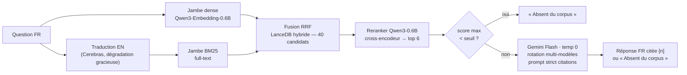

# 🔎 BungeRAG

> Interrogez l'œuvre de Mario Bunge (25 ouvrages, ~8 200 pages) en français.
> Chaque affirmation est citée **[livre, page]**. Si la réponse n'est pas dans le corpus,
> le système répond **« Absent du corpus »** plutôt que d'inventer. Et tout est **mesuré**.

**[🚀 Démo en ligne](https://huggingface.co/spaces/alexisgirard/bungerag)** · [📊 Résultats d'évaluation complets](eval/RESULTS.md) · [📓 Journal de bord](JOURNAL.md)

| Faithfulness | Context recall | Abstention (pièges) | Coût total |
|:---:|:---:|:---:|:---:|
| **0,935** | **0,903** | **8–10 / 10** | **0 €** |

*Mesuré par harnais RAGAS 0.4.3, juge indépendant du générateur (Cerebras gpt-oss-120b), sur 30 questions de fond + 10 questions-pièges hors corpus.*

---

## Pourquoi ce projet

Un RAG (Retrieval-Augmented Generation) de bout en bout — ingestion, chunking, retrieval
hybride, reranking, génération contrainte — dont le **cœur est le harnais d'évaluation** :
je ne promets pas « zéro hallucination », je mesure la fidélité et j'affiche le chiffre,
avec ses limites. Le domaine (la philosophie systémiste de Mario Bunge) impose des
contraintes intéressantes : corpus anglais interrogé en français (cross-lingue), exigence
de citations vérifiables page par page, et abstention obligatoire hors du corpus.

## Architecture



Toute la génération passe par **une seule fonction `generate()`** commutée par variable
d'environnement (`gemini` / `ollama` / `cerebras`) : brancher le backend 100 % local a
coûté une ligne de configuration.

## Les chiffres

### Qualité de bout en bout (RAGAS, juge indépendant)

| Métrique | Score | Ce que ça mesure |
|---|---|---|
| Faithfulness | **0,935** | Les affirmations sont-elles déductibles des extraits cités ? (anti-hallucination) |
| Context precision | **0,893** | Les extraits remontés sont-ils pertinents ? |
| Context recall | **0,903** | Les extraits couvrent-ils la réponse attendue ? |
| Abstention sur pièges | **8/10** strict | « Que pense Bunge du Bitcoin ? » → refus explicite |

Les 2 pièges non refusés n'ont **rien inventé** : réponses partielles explicitement
cadrées sur ce que le corpus contient (Bunge a réellement écrit sur l'IA — et utilise
réellement une « recette du gâteau du Bonheur » comme métaphore ironique).

### Retrieval : l'ablation qui justifie chaque brique

| Configuration | hit@5 | hit@10 |
|---|:---:|:---:|
| BM25 seul (question FR sur corpus EN) | 50 % | 75 % |
| BM25 + reformulation EN | 95 % | 100 % |
| Dense seul (cross-lingue) | 85 % | 100 % |
| **Hybride 40 → reranker → 10** | **95 %** | **100 %** |

### Questions panoramiques : la décomposition mesurée

Les questions larges (« présente la philosophie de Bunge ») sont le point faible connu des
RAG. Un routeur décompose ces questions en sous-questions (retrieval chacune, synthèse
unique) : **4,5 → 6,2 livres cités** en moyenne, citations inline 3,6 → 8,8, et plus
aucune abstention abusive — le pipeline direct refusait la question la plus naturelle
du corpus. Coût API identique (1 appel de génération).

### Local vs API : l'arbitrage chiffré

| | Gemini Flash (API) | Qwen 3.5 9B (100 % local) |
|---|:---:|:---:|
| Faithfulness | **0,935** | 0,912 |
| Abstention pièges | 8/10 (nuancé) | **10/10** (strict) |
| Citations [n] présentes | **28/30** | 26/30 |
| Génération médiane | **~15 s** | 146 s |
| Confidentialité | question envoyée à Google | **rien ne quitte la machine** |

Le verdict n'est pas « le local est moins bon » : c'est un **arbitrage
confidentialité / latence / discipline de citation**, mesuré sur ce cas d'usage précis.

## Stack (100 % gratuit, choix vérifiés puis re-vérifiés)

| Brique | Choix | Pourquoi (résumé) |
|---|---|---|
| Extraction PDF | pymupdf4llm + heuristique anti-en-têtes | markdown structuré ; ~35 000 lignes de « mobilier » retirées |
| OCR (2 livres) | Apple Vision (ocrmac) | local, gratuit, 0,7 s/page |
| Embeddings | Qwen3-Embedding-0.6B (local) | meilleur rapport qualité multilingue/RAM vérifié |
| Base vectorielle | LanceDB embarqué | zéro serveur, hybride dense+BM25 natif, fichiers portables |
| Reranker | Qwen3-Reranker-0.6B | cross-encodeur, +10 pts de hit@5 mesurés |
| Génération | Gemini Flash, **rotation multi-modèles** | le quota réel est ~20 req/jour **par modèle** — la rotation encaisse |
| Éval | RAGAS 0.4.3 (épinglé) + juge Cerebras | juge ≠ générateur : pas de biais d'auto-préférence |
| Démo | Gradio + HF Spaces (CPU gratuit) | index privé téléchargé au démarrage, cache, rate-limits |

## Reproduire avec votre propre corpus

Le corpus (sous droit d'auteur) **n'est pas distribué** — ni les PDF, ni l'index (qui
contient le texte intégral). Le pipeline reconstruit tout depuis vos propres exemplaires :

```bash
git clone https://github.com/alexisgirard-it/bungerag && cd bungerag
python3.12 -m venv .venv && .venv/bin/pip install -r requirements.txt

# 1. vos PDF dans corpus/ + une ligne par œuvre dans manifest.csv
# 2. clés API gratuites dans .env : GEMINI_API_KEY, CEREBRAS_API_KEY
.venv/bin/python src/extract.py        # PDF -> pages de texte propre
.venv/bin/python src/chunk.py          # pages -> chunks 512 tokens
.venv/bin/python src/embed_index.py    # chunks -> vecteurs + index (long, une fois)
.venv/bin/python src/rag.py "Qu'est-ce que l'émergence ?"
```

Mode 100 % local : installez [Ollama](https://ollama.com), `ollama pull qwen3.5:9b`,
puis `LLM_BACKEND=ollama`.

## Leçons de terrain

1. **Les points sont dans les données.** +25 pts de hit@5 en purgeant 837 chunks
   d'annexes (bibliographies, index, préfaces d'éditeur) — sans toucher à l'algorithme.
2. **Le quota documenté n'est pas le quota réel.** ~20 req/jour/modèle constatés vs
   ~1 500 « indicatifs » → rotation multi-modèles implémentée en plein vol.
3. **Un score de reranker mesure la proximité de sujet, pas « ça répond ».** Un piège a
   scoré 0,966 ; l'abstention doit vivre dans le prompt, pas dans un seuil.
4. **Les tokens de « réflexion » (Gemini 2.5, gpt-oss) se décomptent silencieusement**
   des budgets de sortie : deux bugs distincts, une même cause.
5. **La fiabilité du gratuit se construit** : processus tués (mémoire), fournisseurs
   congestionnés, quotas journaliers — réponse : boucles auto-réparantes, cache à chaque
   pas, dégradation gracieuse, supervision. Aucune donnée perdue en ~30 h de calcul.

## Limites assumées

- La faithfulness mesure la fidélité aux extraits **récupérés** — pas la vérité, ni
  l'exhaustivité du retrieval. Les questions panoramiques restent le point faible connu.
- Les références du jeu d'éval sont des brouillons (validation humaine en cours) ;
  le juge n'a fait qu'une passe (variance non mesurée).
- La notation formelle (∀, ∃) des volumes anciens est corrompue par leur couche texte.
- La démo gratuite répond en ~1 min (reranking sur 2 vCPU) — chiffré, expliqué, assumé.

## Structure

```
src/            pipeline complet (extraction → index → RAG → éval → déploiement)
eval/           jeu de questions, résultats (RESULTS.md), exclusions motivées
space/          l'app de démo (Gradio)
manifest.csv    la liste curée du corpus, exclusions justifiées
JOURNAL.md      le journal de bord : décisions, incidents, leçons
```

## Licence

Code sous [MIT](LICENSE). Les œuvres de Mario Bunge restent la propriété de leurs
ayants droit : ce dépôt n'en contient ni n'en distribue aucun extrait.
