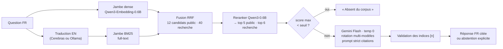

# 🔎 BungeRAG

> Interrogez l'œuvre de Mario Bunge (25 ouvrages, ~8 200 pages) en français.
> Les réponses sont produites avec des renvois **[n]** vers une carte
> ouvrage + page du fichier PDF (ou section EPUB). Si les extraits ne suffisent pas,
> le système doit répondre **« Absent du corpus »**. Et tout est **mesuré**.

**[🚀 Démo en ligne](https://huggingface.co/spaces/alexisgirard/bungerag)** · [📊 Résultats d'évaluation complets](eval/RESULTS.md) · [📓 Journal de bord](JOURNAL.md)

| Faithfulness | Context precision | Context recall | Abstention (pièges) |
|:---:|:---:|:---:|:---:|
| **0,935** | **0,893** | **0,848** | **8 / 10** |

*Résultats du benchmark legacy pré-clôture : chemin direct k=40 → top 6, 30 questions
de fond + 10 questions-pièges. Ce pipeline historique appliquait la reformulation
anglaise aux recherches dense et BM25, sans le routeur ni le nouveau validateur de
sortie. RAGAS 0.4.3, juge Cerebras gpt-oss-120b distinct du générateur ; références
corrigées puis [validées humainement](eval/VALIDATION-HUMAINE.md). Ces scores ne sont
attribués ni au code V1 actuel, ni au Space CPU sans nouveau run fingerprinté.*

---

## Pourquoi ce projet

Un RAG (Retrieval-Augmented Generation) de bout en bout — ingestion, chunking, retrieval
hybride, reranking, génération contrainte — dont le **cœur est le harnais d'évaluation** :
je ne promets pas « zéro hallucination », je mesure la fidélité et j'affiche le chiffre,
avec ses limites. Le domaine (la philosophie systémiste de Mario Bunge) impose des
contraintes intéressantes : corpus anglais interrogé en français (cross-lingue), exigence
de citations vérifiables page par page, et abstention obligatoire hors du corpus.

## Architecture


```mermaid
flowchart LR
    Q[Question FR] --> T["Traduction EN<br/>(Cerebras ou Ollama)"]
    Q --> D[Jambe dense<br/>Qwen3-Embedding-0.6B]
    T --> B[Jambe BM25<br/>full-text]
    D --> H["Fusion RRF<br/>12 candidats public · 40 recherche"]
    B --> H
    H --> R["Reranker Qwen3-0.6B<br/>→ top 5 public · top 6 recherche"]
    R --> S{score max<br/>< seuil ?}
    S -- oui --> A1[« Absent du corpus »]
    S -- non --> G["Gemini Flash · temp 0<br/>rotation multi-modèles<br/>prompt strict citations"]
    G --> V["Validation des indices [n]"]
    V --> A2["Réponse FR citée<br/>ou abstention explicite"]
```

Tous les appels de génération passent par **une seule fonction `generate()`**, commutée
par variable d'environnement (`gemini` / `ollama` / `cerebras`). Dans le code V1,
`LLM_BACKEND=ollama` commute aussi par défaut la traduction et le routeur panoramique
sur Ollama : une exécution annoncée locale ne contacte plus Cerebras silencieusement.
Le bras Ollama chiffré plus bas est antérieur à ce durcissement et utilisait encore
Cerebras pour la reformulation lorsqu'il était disponible.

Deux profils immuables rendent les futurs runs explicites : `public_v1` (chemin direct
12 → 5, adapté au Space CPU) et `research_40x6` (chemin direct 40 → 6). Ce dernier
reprend les mêmes valeurs de k que le benchmark legacy, mais pas son pipeline : aucun
score historique ne lui est attribué. Toute surcharge produit un nouvel identifiant
de configuration.

## Les chiffres

### Qualité de bout en bout (run legacy pré-clôture, juge indépendant)

| Métrique | Score | Ce que ça mesure |
|---|---|---|
| Faithfulness | **0,935** | Les affirmations sont-elles déductibles des extraits cités ? (anti-hallucination) |
| Context precision | **0,893** | Les extraits remontés sont-ils pertinents ? |
| Context recall | **0,848** | Les extraits couvrent-ils la réponse attendue ? |
| Abstention sur pièges | **8/10** strict | « Que pense Bunge du Bitcoin ? » → refus explicite |

Les 2 pièges non refusés n'ont **rien inventé** : réponses partielles explicitement
cadrées sur ce que le corpus contient (Bunge a réellement écrit sur l'IA — et utilise
réellement une « recette du gâteau du Bonheur » comme métaphore ironique).

### Retrieval : l'ablation qui justifie chaque brique

| Configuration | hit@5 | hit@10 |
|---|:---:|:---:|
| BM25 seul (question FR sur corpus EN) | 50 % | 75 % |
| BM25 + reformulation EN | 95 % | 100 % |
| Dense seul (cross-lingue) | 85 % | 100 % |
| **Hybride 40 → reranker → 10** | **95 %** | **100 %** |

### Questions panoramiques : la décomposition mesurée

Les questions larges (« présente la philosophie de Bunge ») sont le point faible connu des
RAG. Un routeur décompose ces questions en sous-questions (retrieval chacune, synthèse
unique) : **4,5 → 6,2 livres cités** en moyenne, citations inline 3,6 → 8,8, et plus
aucune abstention abusive — le pipeline direct refusait la question la plus naturelle
du corpus. Le chemin conserve un seul appel de génération Gemini et ajoute un appel
Cerebras pour le routage et la décomposition.

### Local vs API : l'arbitrage chiffré historique

| Métrique | Gemini Flash (API) | Qwen 3.5 9B (génération locale) |
|---|:---:|:---:|
| Faithfulness | **0,935** | 0,904 |
| Context precision | 0,893 | **0,903** |
| Context recall | 0,848 | **0,885** |
| Abstention pièges | 8/10 (nuancé) | **10/10** (strict) |
| Exécution | réponse via Gemini | retrieval + réponse locaux ; utilitaire Cerebras externe |

Le verdict n'est pas « le local est moins bon » : c'est un **arbitrage
confidentialité / latence / discipline de citation**, mesuré sur ce cas d'usage précis.

### Sentence-window : résultat expérimental séparé

Un bras expérimental legacy étend chaque chunk retenu à ses voisins au moment de la
génération. Sa mesure historique indiquait **0,969** de faithfulness, **0,873** de
context precision, **0,922** de context recall et **9/10** abstentions. Les caches bruts
et métadonnées de ce run ne sont pas versionnés : ces chiffres ne sont donc pas un
benchmark reproductible du code V1. Le code expérimental exact est préservé au commit
`aec4846` sur la branche `experiment/sentence-window-v1.1`, hors du Space et de la V1.

## Stack (100 % gratuit, choix vérifiés puis re-vérifiés)

| Brique | Choix | Pourquoi (résumé) |
|---|---|---|
| Extraction PDF | pymupdf4llm + heuristique anti-en-têtes | markdown structuré ; ~35 000 lignes de « mobilier » retirées |
| OCR (2 livres) | Apple Vision (ocrmac) | local, gratuit, 0,7 s/page |
| Embeddings | Qwen3-Embedding-0.6B (local) | meilleur rapport qualité multilingue/RAM vérifié |
| Base vectorielle | LanceDB embarqué | zéro serveur, hybride dense+BM25 natif, fichiers portables |
| Reranker | Qwen3-Reranker-0.6B | cross-encodeur, +10 pts de hit@5 mesurés |
| Génération | Gemini Flash, **rotation multi-modèles** | le quota réel est ~20 req/jour **par modèle** — la rotation encaisse |
| Éval | RAGAS 0.4.3 (épinglé) + juge Cerebras | juge ≠ générateur : pas de biais d'auto-préférence |
| Démo | Gradio + HF Spaces (CPU gratuit) | index privé téléchargé au démarrage, cache, rate-limits |

## Fermeture technique V1

- Le build canonique (`src/build_index.py`) vérifie chaque étape et produit un manifeste
  avec hashes du chunking, révision exacte du modèle d'embedding et exclusions appliquées.
- La localisation page par page recherche désormais le **texte intégral** de chaque chunk
  avec gestion de l'overlap. Sur le corpus courant, les 11 249 textes et identifiants sont
  restés identiques ; 38 plages ont été corrigées, dont 37 présentes dans l'index filtré.
  La migration vérifiée ne recalcule donc aucun embedding.
- Chaque run d'évaluation reçoit une empreinte du commit, du code, du prompt, des questions
  et de la configuration. Deux configurations ne peuvent plus partager silencieusement
  leurs caches.
- Les chemins direct et panoramique renvoient le même schéma ; les indices `[n]` sont
  contrôlés avant exposition. Cette validation garantit un renvoi vers une source affichée,
  pas la vérité de l'interprétation.
- Le prompt interdit la restitution du corpus et un garde-fou déterministe retire toute
  réponse recopiant plus de 20 mots consécutifs d'un contexte. Les extraits publics sont
  eux aussi bornés à 20 mots.
- La démo a une interface Gradio entièrement personnalisée, un cache borné, des quotas
  atomiques, un seul endpoint public et ne publie ni contextes internes ni scores bruts.
- La CI compile le code, exécute les tests unitaires sans corpus/API, applique Ruff et
  recherche les secrets. Le déploiement exige deux jetons Hugging Face distincts : écriture
  locale et lecture limitée au dataset privé pour le Space.

Avant le prochain déploiement, l'ancien secret `HF_TOKEN` du Space doit être remplacé par
un nouveau jeton de lecture fine-grained limité au dataset, puis l'ancien jeton — utilisé
historiquement aussi pour écrire — doit être révoqué. `src/push_space.py` vérifie désormais
l'accès réel du jeton read-only, installe les secrets avant le build et synchronise
exactement le dépôt public avec sa liste blanche.

## Reproduire avec votre propre corpus

Le corpus (sous droit d'auteur) **n'est pas distribué** — ni les PDF, ni l'index (qui
contient le texte intégral). Le pipeline reconstruit tout depuis vos propres exemplaires :

```bash
git clone https://github.com/alexisgirard-it/bungerag && cd bungerag
python3.12 -m venv .venv && .venv/bin/pip install -r requirements.txt

# 1. vos PDF dans corpus/ + une ligne par œuvre dans manifest.csv
# 2. clés API gratuites dans .env : GEMINI_API_KEY, CEREBRAS_API_KEY
.venv/bin/python src/build_index.py --extract --size 512  # pipeline complet + validations
.venv/bin/python src/rag.py "Qu'est-ce que l'émergence ?"
```

Si les extractions ont déjà été vérifiées, omettez `--extract`. Le corpus et l'index
restent volontairement hors Git.

Mode de génération locale : installez [Ollama](https://ollama.com),
`ollama pull qwen3.5:9b`, puis lancez avec `LLM_BACKEND=ollama`. La génération, la
traduction FR→EN et le routage panoramique utilisent alors Ollama par défaut. Une
expérience hybride reste possible avec `RAG_TRANSLATOR_BACKEND` ou
`RAG_ROUTER_BACKEND`, mais elle devient une surcharge explicite et fingerprintée.

## Leçons de terrain

1. **Les points sont dans les données.** +25 pts de hit@5 en purgeant 837 chunks
   d'annexes (bibliographies, index, préfaces d'éditeur) — sans toucher à l'algorithme.
2. **Le quota documenté n'est pas le quota réel.** ~20 req/jour/modèle constatés vs
   ~1 500 « indicatifs » → rotation multi-modèles implémentée en plein vol.
3. **Un score de reranker mesure la proximité de sujet, pas « ça répond ».** Un piège a
   scoré 0,966 ; l'abstention doit vivre dans le prompt, pas dans un seuil.
4. **Les tokens de « réflexion » (Gemini 2.5, gpt-oss) se décomptent silencieusement**
   des budgets de sortie : deux bugs distincts, une même cause.
5. **La fiabilité du gratuit se construit** : processus tués (mémoire), fournisseurs
   congestionnés, quotas journaliers — réponse : boucles auto-réparantes, cache à chaque
   pas, dégradation gracieuse, supervision. Aucune donnée perdue en ~30 h de calcul.

## Limites assumées

- La faithfulness mesure la fidélité aux extraits **récupérés** — pas la vérité, ni
  l'exhaustivité du retrieval. (Le point faible panoramique a été traité par la
  décomposition, mesures à l'appui — voir ci-dessus.)
- Les références du jeu d'éval ont été vérifiées contre le corpus (23 confirmées,
  7 corrigées avec preuves), puis les 7 corrections ont été
  [validées humainement](eval/VALIDATION-HUMAINE.md) le 2026-07-31. Le juge RAGAS n'a
  fait qu'une passe par réponse et métrique ; sa variance n'est pas mesurée.
- Le benchmark legacy utilisait un chemin direct k=40 → top 6 et une requête EN commune
  aux jambes dense et BM25. Le code V1 sépare dense FR et BM25 EN, puis route les questions
  panoramiques : il s'agit d'un pipeline différent, encore sans benchmark complet.
- Sur le Space, le chemin direct utilise 12 → 5 ; le chemin panoramique prend 8 candidats
  par sous-question et expose au maximum 12 sources. Aucun score RAGAS ne lui est attribué.
- Les renvois PDF utilisent la page du fichier/lecteur, pas toujours la pagination imprimée ;
  l'anthologie EPUB est repérée par section.
- La notation formelle (∀, ∃) des volumes anciens est corrompue par leur couche texte.
- La démo gratuite répond en ~1 min (reranking sur 2 vCPU) — chiffré, expliqué, assumé.

## Structure

```
src/            pipeline complet (extraction → index → RAG → éval → déploiement)
eval/           jeu de questions, résultats, revue et validation humaine
space/          l'app de démo (Gradio)
tests/          tests unitaires sans corpus, modèle lourd ni API
manifest.csv    la liste curée du corpus, exclusions justifiées
JOURNAL.md      le journal de bord : décisions, incidents, leçons
```

## Licence

Code sous [MIT](LICENSE). Les œuvres de Mario Bunge restent la propriété de leurs
ayants droit. Le dépôt ne distribue ni PDF, ni corpus intégral, ni index textuel ; les
fichiers d'évaluation contiennent seulement de courtes citations sourcées nécessaires
à la vérification des références.
